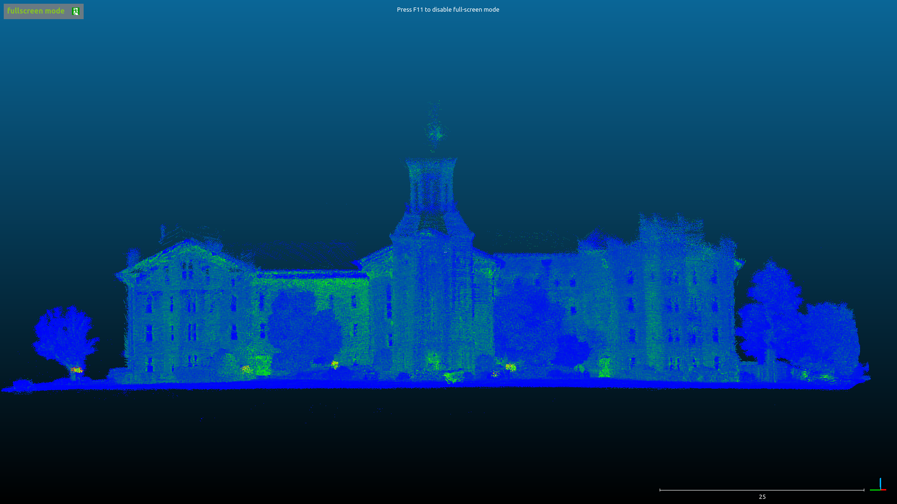

# ingenium_cartographer
  Bash scripts and config files for recording and slamming data for the Wheaton College Tel Shimron lidar project. This branch is being edited to use ROS2 Jazzy Jalisco. As of this writing (June 2025) it is NOT complete, and NOT functional. 

## A Brief Note About the Jazzy Branch
  This is a branch off a main codebase which was written almost 10 years ago. Much of the knowledge of how the original codebase worked has since been lost. Therefore, in the summer of 2025, Abraham began to reverse-engineer the various scripts, learning bash as he did so. In the above scripts, comments which were original to the document are denoted by a solitary hashtag: #. 
Abraham's original reverse-engineering comments are denoted by a triple hashtag: ###. These represent his best guess as to what the code does, but he did not write it nor does he fully understand all of it.

Thereafter, Abraham's comments are denoted by #AB
Milan's comments are denoted by #MS 

## Installation Instructions
  The order of these steps is very important, and not following this order can lead to irreparable problems with the installation.

0. If installing on Pi, make sure to add a swap file. Typically do 4G instead of the 2G listed [here](https://linuxize.com/post/how-to-add-swap-space-on-ubuntu-20-04/). Also install pcap `sudo apt-get install libpcap-dev`

1. Install ROS Jazzy using their [guide](https://docs.ros.org/en/jazzy/Installation/Ubuntu-Install-Debs.html)
2. 
